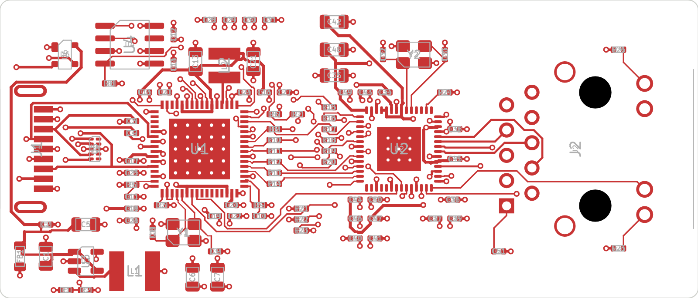

# Network Goblin ND-2

**A Linux-powered handheld network multitool with real cable diagnostics.**

ND-2 is the bigger sibling of the [ND-1](#the-network-goblin-family) pocket cable tester. It's a custom carrier board for the Raspberry Pi Compute Module 5 with:

- a **dedicated test port** that can find opens, shorts and distance-to-fault on each pair (PHY-based TDR),
- a second gigabit port for uplink, capture and inline tapping,
- a touchscreen, battery power, 2x USB-A and HDMI out,
- a normal Linux distro underneath, so tcpdump, Wireshark, iperf3, nmap and friends just work.

Everything here, hardware and software, is open source under the MIT license.

> **Status: early hardware.** The first board, the **TDR proof dongle**, is at the fab. The full ND-2 carrier is still at the spec stage. Nothing here has been tested on real hardware yet.

---

## What's in this repo

| Path | What it is |
|---|---|
| [`docs/spec.md`](docs/spec.md) | Full ND-2 hardware spec (draft): architecture, part choices, power, BOM, risks |
| [`docs/roadmap.md`](docs/roadmap.md) | Where the project is going and in what order |
| [`docs/bring-up.md`](docs/bring-up.md) | Step-by-step first power-on and test plan for the TDR dongle |
| [`docs/ordering-jlcpcb.md`](docs/ordering-jlcpcb.md) | Exact JLCPCB settings used to order the dongle, and how to keep the cost down |
| [`hardware/tdr-dongle/`](hardware/tdr-dongle/) | **Rev A TDR proof dongle**: KiCad project, fab files, BOM, pick-and-place |
| [`hardware/nd2-carrier/`](hardware/nd2-carrier/) | The full CM5 carrier board (not started yet) |
| [`software/cabletest/`](software/cabletest/) | `nd2-cabletest`: a friendly wrapper around the Linux cable-test tools |

## The TDR proof dongle (Rev A)



A 70 x 30 mm USB 3 to gigabit Ethernet dongle that is **just the ND-2 test-port circuit**:

- **Microchip LAN7801**: USB 3 to RGMII MAC (`lan78xx` driver, mainline Linux)
- **Marvell 88E1512**: gigabit PHY with Virtual Cable Tester / TDR (`marvell` PHY driver, mainline Linux)
- **HanRun HR911130C**: 1G RJ45 magjack with LEDs
- 4-layer, 1.6 mm, all SMD parts on the top side, assembled by JLCPCB

It exists to prove that `ethtool --cable-test` works on this chip combo before building the full carrier. If it works, it's also useful by itself: **plug it into any Pi 5 or Linux laptop and you have a TDR cable tester.**

See [`hardware/tdr-dongle/README.md`](hardware/tdr-dongle/README.md) for the design details and fab files.

## Quick try (once you have a dongle)

```bash
# On a Pi 5 or any Linux machine with ethtool 5.8+ and a recent kernel
lsusb | grep 0424:7801             # the LAN7801 should show up
ip link                            # find the new interface, e.g. eth1
sudo ethtool --cable-test eth1     # per-pair OK / open / short + fault distance

# or the friendlier wrapper from this repo
sudo python3 software/cabletest/nd2-cabletest.py eth1
```

Unplug the far end of the cable first. TDR results are unreliable while there's an active link partner.

## The Network Goblin family

| Device | What it is |
|---|---|
| **ND-1** | Cheap, instant-on pocket cable tester. ESP32 + LAN8742A, 3.5" LCD. |
| **ND-2** | This repo. Linux handheld multitool on CM5, with a TDR test port. |
| **TDR dongle** | The ND-2 test port on its own, as a USB 3 dongle for any Linux box. |

## Contributing

Issues and pull requests are welcome, whether it's hardware review, bring-up results or software. See [CONTRIBUTING.md](CONTRIBUTING.md). Hardware bring-up reports on real boards are especially useful right now.

## License

[MIT](LICENSE), covering both hardware and software. Build it, fork it, sell it; a credit back to the project is appreciated.

**Not certified:** ND-2 isn't FCC/CE certified and isn't a TIA/ISO cable certifier. It tells you whether a cable is healthy enough, not whether it passes a formal certification test.
