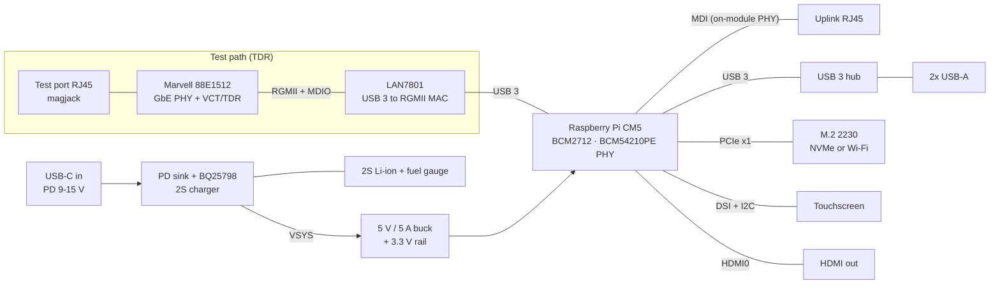

# Network Goblin ND-2 — Hardware Spec (Draft)

*Draft, 2026-09-25. Mirrors the working spec doc; this copy lives with the hardware so changes can go through pull requests.*

## 1. Overview

ND-2 is the Linux-powered member of the Network Goblin family: a handheld network multitool built as a custom carrier board for the Raspberry Pi Compute Module 5. ND-1 stays the cheap, instant-on pocket cable tester (ESP32 + LAN8742A). ND-2 is the one you bring when you need to capture, measure, tap and poke at a live network.

**Goals**

- Cable diagnostics on a dedicated test port: per-pair open/short detection, distance to fault and cable length (PHY TDR).
- Two gigabit Ethernet ports: one test port with TDR, one general-purpose port.
- Packet capture (tcpdump / Wireshark / tshark), iperf3 throughput testing, inline tap (bridge), port-mirror target.
- Security-oriented tooling (nmap, scapy, Kismet-type tools, etc.) on a standard Linux distro.
- Handheld and battery powered, with a small capacitive touchscreen running a custom GUI.
- 2x USB-A, one HDMI output for occasional desk use.
- Fully open source (hardware + software), kept at a sensible cost so the community can build it.

**Non-goals**

- TIA/ISO cable **certification** (NEXT, return loss, insertion loss up to 250–500 MHz). PHY-based TDR can't do that, and it's not the point. ND-2 checks that a line is in spec *enough*, or mostly in spec.
- A fail-open passive tap in Rev A (inline tap is an active Linux bridge; see Risks).
- Wiremap / split-pair detection without a remote unit (possible future accessory).

## 2. System architecture

*ND-2 system architecture (CM5 carrier). The top group is the TDR test path.*

The CM5's two USB 3 ports do the heavy lifting: one feeds a LAN7801 + Marvell 88E1512 to make the TDR-capable test port, the other feeds a small hub for the two USB-A ports. The CM5's own gigabit PHY becomes the uplink port, which leaves the single PCIe lane free for an M.2 slot.

| Interface | Source on CM5 | Used for |
|---|---|---|
| eth0 (native) | On-module BCM54210PE PHY | Uplink / capture / mirror target / iperf |
| eth1 (test) | USB 3 port 0 → LAN7801 → Marvell 88E1512 | Cable diagnostics, link tests, second leg of inline tap |
| USB-A x2 | USB 3 port 1 → 4-port USB 3 hub | Adapters, Wi-Fi dongles, storage, keyboard |
| M.2 2230 (M- or E-key, TBD) | PCIe Gen2/3 x1 | NVMe for captures or a monitor-mode Wi-Fi card |
| Touchscreen | MIPI DSI (4-lane) + I2C | Primary UI |
| HDMI | HDMI0 | Occasional desktop use |
| USB-C | Power input (+ optional USB 2 gadget/console) | Charging, data link to a laptop |

## 3. Compute module

**Choice: Raspberry Pi Compute Module 5.** From the [CM5 datasheet](https://datasheets.raspberrypi.com/cm5/cm5-datasheet.pdf):

- 2x USB 3.0 (5 Gb/s, usable at the same time) + 1x USB 2.0
- 1x PCIe Gen 2 x1 (Gen 3 possible but unsupported)
- On-module Broadcom BCM54210PE gigabit PHY with IEEE 1588 PTP
- 2x HDMI 2.0, 2x 4-lane MIPI (DSI or CSI)
- 5 V input (4.75–5.25 V), up to 5 A budget with USB loads; ~0.4 A idle, ~0.9 A typical
- PWR_BUT (pin 92), PMIC_EN (pin 99), RTC VBAT (pin 76), Fan_PWM / Fan_Tacho (pins 19/16)

**Why not CM4:** the CM4 only has USB 2.0 (480 Mb/s). A USB-attached second NIC would be stuck well below gigabit, and the only way around that is the single PCIe lane, which is then gone for USB 3 or storage. PCIe NICs that work well on the Pi (Realtek RTL8111, Intel i210/i225) have no cable-test support in Linux. The CM5's native USB 3 removes the whole problem.

**Variants to support:**

| Variant | Notes |
|---|---|
| CM5 Lite (no eMMC), 2–4 GB | Cheapest build. Boots from microSD slot on the carrier (or NVMe if M.2 is M-key). Recommended community default. |
| CM5 with eMMC, 4–8 GB | Faster, more robust boot. Heavier Wireshark/Kismet use benefits from 4 GB+. |
| Wireless vs non-wireless | Either works. On-module Wi-Fi is fine for management; monitor-mode security work should use a USB or M.2 adapter anyway. Needs antenna keep-out (10 mm) or U.FL if the case is metal. |

The carrier keeps the standard 2x 100-pin Hirose DF40 footprint. A CM4 would physically fit but would lose USB 3 (so the test port and USB-A ports fall back to USB 2 speeds); treat that as unsupported rather than a design target.

## 4. Networking

### 4.1 Test port (eth1): LAN7801 + Marvell 88E1512

- **MAC bridge:** Microchip LAN7801, 64-pin SQFN. USB 3.0 SuperSpeed + USB 2.0 upstream to CM5 USB3 port 0 (0.1 µF AC-coupling caps on SS TX). Linux driver: `lan78xx` (mainline, used on the Pi 3B+ already). The LAN7801 stays no matter which PHY sits behind it; it's what turns USB 3 into an Ethernet MAC.
  - 25 MHz crystal; REFCLK_25 output can clock the PHY (saves a second crystal).
  - Internal 2.5 V LDO and 1.2 V switcher (needs 3.3 µH + 22 µF).
  - VDDVARIO = 3.3 V or 1.8 V for the RGMII bank; match the PHY's VDDO.
  - 3-wire 93C66-type EEPROM for MAC address and config, including the MAC-side RGMII clock delays (not optional with the Marvell PHY).
  - ~10 Ω series resistors on RGMII lines, 1.5 k pull-up on MDIO.
- **PHY: Marvell 88E1512** (56-pin QFN 8x8, LCSC C845579, ~$11 at qty 1 vs ~$3.70 for the KSZ9131RNX). RGMII to the LAN7801, MDI to the RJ45. Linux driver: `marvell`, which supports both `--cable-test` (per-pair status + fault distance) and `--cable-test-tdr` (raw amplitude vs. distance for a real TDR trace).
  - Runs from a single 3.3 V supply using its internal switching regulator; VDDO selectable 1.8/2.5/3.3 V.
  - RGMII delays must be added in exactly one place. Plan: the LAN7801 adds TX/RX clock delays (set in its EEPROM) and the PHY runs plain RGMII. Others have paired non-Microchip PHYs with the LAN7801 this way. Fallback: have the PHY insert the delays instead (register-configured; the Marvell driver does this from the interface mode) through a small driver/overlay tweak.
  - Reference clock from LAN7801 REFCLK_25; keep a 25 MHz crystal footprint as a DNP backup.
  - Docs: Marvell's full register manual is behind their customer portal, but a public product datasheet exists and the mainline Linux driver already implements the VCT/TDR sequences, so nothing ND-2 needs is locked away.
  - Fallback part: KSZ9131RNX (Microchip's own LAN7801 pairing, simpler bring-up, no raw TDR). Not footprint-compatible, so the choice is made per board revision.
- **Connector:** RJ45 magjack with integrated magnetics and LEDs (same family as ND-1, e.g. HanRun HR911130 class 1G part). TVS array on MDI pairs (e.g. low-capacitance 4-line array), shield to chassis ground through RC.

### 4.2 Uplink port (eth0): CM5 native

- CM5's BCM54210PE MDI pairs route straight to a second 1G magjack. LEDs from CM5 Ethernet_nLED pins.
- This is the "fast" port: on-SoC MAC, PTP-capable, lowest latency. Use it for iperf, captures and as the mirror target.

### 4.3 Operating modes (software)

| Mode | Ports | Notes |
|---|---|---|
| Cable test | eth1 | Link down, run TDR, show per-pair result + distance |
| Link / port check | eth1 or eth0 | Negotiated speed/duplex, PoE present (future), LLDP/CDP neighbor, VLAN, DHCP, gateway ping, DNS |
| Throughput | eth0 (or both) | iperf3 client/server; port-to-port loopback test through a switch |
| Capture | eth0 / eth1 | tcpdump/tshark to NVMe or USB; live summary on screen; export pcap |
| Port-mirror target | eth0 | Promiscuous capture from a switch SPAN port |
| Inline tap | eth0 + eth1 bridged | Linux bridge; capture on br0. Active tap: link breaks if ND-2 powers off |
| Security tools | any | nmap, scapy, arp-scan, responder-type tools, Kismet with USB/M.2 Wi-Fi |

Throughput note: USB 3 gives the LAN7801 plenty of headroom for 1 Gb/s line rate, but bridging both ports at full duplex line rate will be CPU-bound. Expect it to be fine for typical tap/capture use; benchmark in bring-up.

## 5. Cable diagnostics

**What the 88E1512 Virtual Cable Tester (VCT) gives you** through the standard Linux ethtool netlink cable-test API (driver already in mainline, no NDA needed):

- Per pair (A–D): OK, open, short within pair, short to another pair
- Distance to the fault; Marvell specs fault location to within about 1 m
- **Raw TDR trace:** `--cable-test-tdr` returns reflection amplitude vs. distance for each pair, with configurable start/stop/step. The GUI can plot a real TDR view that shows bad connectors, kinks and mismatched patch cords, not just open/short.
- **Cable length:** leave the far end unplugged; each pair shows an open at the cable's end, and that distance is the length. The GUI should prompt for this ("Unplug far end for length").
- **With link up at 1 Gb/s:** the PHY's DSP also estimates cable length and reports pair swaps, polarity and pair skew in vendor registers. ethtool doesn't expose these, but a small MDIO helper can read them for the link-check screen.

**How the test runs:** the driver drops the link while testing. Results are cleanest with the far end unplugged or its device powered off; the GUI should warn when a link partner is detected.

**What it can't do**

- Certification-grade measurements (NEXT, return loss, insertion loss vs. frequency)
- Split-pair detection and full wiremap without a remote identifier at the far end
- Length through ethtool on a cable plugged into a live switch (pairs read OK with no distance; use the DSP length estimate instead)

**Filling the gaps cheaply**

- **Link qualification:** force 1000BASE-T, run a 30 s iperf3 or packet-generator test against a known endpoint, read PHY error counters and link flaps. "Passes gigabit cleanly" is the practical in-spec check.
- **Wiremap remote (future accessory):** a tiny passive or MCU-based terminator with distinct resistor/diode signatures per pair, like the remotes that come with cheap wiremap testers. Could be shared with ND-1.

**Software path:** `ethtool --cable-test eth1` for the pass/fail summary and `ethtool --cable-test-tdr eth1` for the trace. The GUI calls the same netlink API directly (pyroute2 or libmnl).

## 6. USB, storage and expansion

- **USB 3 hub:** VIA VL817 (4-port USB 3.0 hub, widely stocked, cheap) on CM5 USB3 port 1. Two downstream ports go to USB-A; the spare two are left for a future internal module (e.g. an internal Wi-Fi or SDR daughterboard).
- **2x USB-A:** vertical or right-angle USB 3 receptacles. Each behind a current-limited load switch (~1 A each, e.g. TPS2553-class) so a shorted dongle can't brown out the CM5. ESD protection on D+/D− and SS pairs.
- **USB-C:** power input (see Power). Optionally route CM5's USB 2.0 port here too for gadget mode (serial console / USB-Ethernet to a laptop) with a mux or simple jumper; verify CM5 device-mode support on this port during bring-up.
- **microSD:** required for CM5 Lite (SDIO on the CM5 connector). Push-push socket, card-detect to a GPIO.
- **M.2 slot (PCIe x1):** recommend **M-key 2230/2242 for NVMe** as the default. Captures go to fast storage, and the Pi 5 ecosystem supports NVMe boot. Monitor-mode Wi-Fi is better served by USB adapters, which have more mature driver support. Include a PCIe CLKREQ/reset per CM5 IO board reference, 3.3 V at 2–3 A from its own buck.
- **HDMI:** one micro- or mini-HDMI (full-size if the case allows) on HDMI0, with an HDMI ESD/level companion (TPD12S016-class) handling DDC level shifting, HPD and the 5 V current limit.
- **Fan header:** 2-pin or 4-pin to CM5 Fan_PWM/Fan_Tacho. A small blower is likely needed in an enclosed handheld during long captures.

## 7. Display, controls and indicators

**Display:** MIPI DSI touchscreen on one of the CM5's 4-lane MIPI ports, 22-pin 0.5 mm FPC (the CM-style DSI connector; 2-lane panels also fit). Touch controller on the I2C lines in the same cable, backlight/touch power from a separate 5 V / 3.3 V pin header.

| Option | Size / res | Why |
|---|---|---|
| Raspberry Pi Touch Display 2 (5") | 720x1280 | Official driver, zero bring-up work, easy for builders to buy |
| Waveshare 4.3" or 5" DSI LCD | 800x480 | Cheaper, smaller, Pi-compatible overlays exist |
| Bare DSI panel + custom FPC | 4–5" | Best fit for a handheld case later; more driver work |

Recommendation: design around the official 5" panel for Rev A (known-good), keep the connector generic so cheaper panels work.

**Controls**

- Power button to CM5 PWR_BUT (short press = on / clean shutdown, hold 5 s = force off)
- Hard power switch in the battery path for storage/shipping
- 3–4 GPIO buttons: Back, Home, and a dedicated **Test** button that runs a cable test on eth1 without touching the screen

**Indicators and extras**

- Charge status LED from the charger; one addressable RGB status LED (test pass/fail, capture running)
- Magjack LEDs on both ports
- RTC: rechargeable ML2032-type cell or supercap to CM5 VBAT so capture timestamps survive battery swaps
- Debug UART header (3-pin) and a Qwiic/STEMMA I2C connector for add-ons (e.g. a PoE detector board)

## 8. Power system

**Why 2S, not 1S:** peak system load is 15–20 W with USB devices attached. From a single 3.7 V cell that's 5+ A through a boost converter, which means hot inductors, big voltage droop and early brown-outs. A 2S pack (6.0–8.4 V) lets a simple buck make 5 V efficiently.

**Chain:** USB-C → PD sink → buck-boost charger with power path → VSYS (pack voltage) → 5 V / 5 A buck → CM5 + peripherals; a second buck from VSYS for 3.3 V (M.2, LAN7801, PHY).

| Block | Part (proposed) | Notes |
|---|---|---|
| PD sink | TI TPS25730 | Standalone, strap-configured (no firmware), integrated power switches, LCSC stocked. Request 9–15 V; falls back to 5 V on dumb chargers |
| Charger / power path | TI BQ25798 | I2C, 1–4 cell, 5 A buck-boost, 3.6–24 V input. Buck-boost means even a plain 5 V USB charger can charge the 2S pack. Runs the system from USB when plugged in |
| Battery | 2S1P Li-ion, 21700 or 18650 (with PCM) | 2x 21700 5000 mAh ≈ 36 Wh. Use a pack with built-in protection + balancing, or add a 2S protector/balancer (e.g. BQ29209-class) |
| Fuel gauge | TI BQ34Z100-G1 | Multi-cell gauge with real %-remaining; I2C to CM5. Low-battery interrupt triggers clean shutdown |
| 5 V rail | 5 V / 5–6 A sync buck (e.g. TPS56637-class, 4.5–28 V in) | Feeds CM5 (via its 5 V pins), USB hub, USB-A load switches, display |
| 3.3 V rail | 3 A sync buck from VSYS | M.2, LAN7801, 88E1512 (the CM5's own 3.3 V output is only ~600 mA total, not enough) |
| On/off | CM5 PWR_BUT + PMIC_EN, hard switch in pack line | Gauge/charger stays alive for charging while the system is off |

**Power budget (estimates, to confirm on the bench)**

| Load | Typical | Peak |
|---|---|---|
| CM5 (idle ~2 W, working ~4.5 W) | 4.5 W | 10 W |
| LAN7801 + 88E1512 at 1 Gb/s | 1.0 W | 1.5 W |
| 5" DSI display + backlight | 1.5 W | 2.0 W |
| USB hub | 0.5 W | 0.8 W |
| NVMe (idle / writing) | 0.5 W | 3.0 W |
| USB-A devices (e.g. Wi-Fi adapter) | 1.5 W | 9.0 W (2x 0.9 A) |
| **Total** | **~9.5 W** | **~26 W** |

The worst case assumes both USB-A ports at full current while the CPU and NVMe are maxed out, which is rare; firmware can cap USB-A current if needed. Expected runtime on a 36 Wh pack at ~9.5 W average with ~88% conversion efficiency: **roughly 3–3.5 hours** of active use.

## 9. Preliminary BOM (key parts)

Passives, ESD parts and connectors beyond the main ones are left out. Part numbers are starting points; check LCSC/JLC stock before locking the schematic.

| Function | Part | Qty | Package |
|---|---|---|---|
| Compute | Raspberry Pi CM5 (Lite 4 GB suggested default) | 1 | Module |
| CM connectors | Hirose DF40C-100DS-0.4V (carrier side) | 2 | 100-pin |
| USB3 → RGMII MAC | Microchip LAN7801 | 1 | 64-SQFN |
| TDR PHY | Marvell 88E1512-A0-NNP2C000 (fallback: KSZ9131RNX) | 1 | 56-QFN 8x8 |
| MAC config EEPROM | 93C66-type 3-wire (required: MAC + RGMII delay config) | 1 | SOT-23/SOIC |
| 25 MHz crystal | For LAN7801 (PHY clocked from REFCLK_25) | 1 | 3225 |
| RJ45 magjack, 1G, LEDs | HanRun HR911130-class | 2 | THT |
| USB 3 hub | VIA VL817 | 1 | QFN-76 |
| USB-A receptacles (USB 3) | Generic | 2 | THT |
| USB-A load switches | TPS2553-class | 2 | SOT-23-6 |
| HDMI companion | TPD12S016-class | 1 | QFN |
| micro/mini HDMI connector | Generic | 1 | SMD |
| M.2 M-key socket + standoff | Generic | 1 | SMD |
| microSD socket | Push-push | 1 | SMD |
| DSI FPC connector | 22-pin 0.5 mm | 1 | SMD |
| USB-C receptacle (16-pin) | Generic | 1 | SMD |
| PD sink | TI TPS25730 | 1 | QFN |
| Charger | TI BQ25798 | 1 | QFN-29 |
| Fuel gauge | TI BQ34Z100-G1 | 1 | TSSOP-14 |
| 5 V buck | TPS56637-class + inductor | 1 | SOT/QFN |
| 3.3 V buck | 3 A sync buck + inductor | 1 | SOT |
| RTC cell | ML2032 rechargeable + holder | 1 | THT/SMD |
| Battery | 2S 21700 pack with PCM + JST-XH balance lead | 1 | — |

## 10. Cost strategy for open-source adoption

The CM5 is the single most expensive part, so most savings come from letting builders pick their own module and leaving optional parts unpopulated.

- **The carrier doesn't include the module.** Builders choose any CM5: a Lite 2–4 GB for a budget build, eMMC/8 GB for heavy capture work. Document which features need which RAM size.
- **Optional-population zones:** M.2 slot, HDMI, hub ports 3–4, fan header and fuel gauge can be left off without breaking anything. Mark them DNP-friendly in the BOM.
- **Buy-don't-build for the screen and battery:** off-the-shelf DSI panel and a standard 2S pack keep the carrier simple and JLC-assemblable.
- **Keep all fine-pitch parts on one side** so JLCPCB standard assembly can do the whole board; hand-solder only THT (RJ45, USB-A, battery connector).
- **Public documentation first** (Microchip, TI, VIA). The one partial exception is the Marvell PHY: its full register manual is gated, but everything ND-2 uses is already in the open-source Linux driver, so forks aren't blocked.
- **Firmware reuse:** the ND-1 LVGL UI concepts can carry over. LVGL runs on Linux framebuffer/DRM, so screens, icons and the goblin style can be shared between ND-1 and ND-2.

## 11. Risks, open questions and bring-up plan

**Risks**

| Risk | Impact | Mitigation |
|---|---|---|
| lan78xx + external PHY RGMII delay setup | Test port doesn't link or has CRC errors | Set delays in one place (LAN7801 EEPROM), keep PHY-side delay as a fallback, prove it on a small LAN7801 + 88E1512 test board before the full carrier |
| TDR less reliable with a live link partner | Wrong or "unknown" results | GUI detects a link partner and asks the user to unplug the far end |
| High-speed routing (USB 3, PCIe, HDMI, DSI, MDI) | Signal integrity problems | 4- or 6-layer stackup with controlled impedance (90 Ω USB/PCIe, 100 Ω MIPI/HDMI/MDI); copy the CM5 IO board's routing rules |
| Thermal in a closed handheld | CPU throttling during capture | Fan header, CM5 heatsink contact to case, measure early |
| 2S pack safety and shipping | Fire risk, hard to ship kits | Only protected packs; builder sources battery locally |
| Active tap fails closed | Inline link drops if ND-2 dies | Document it; consider a relay-based bypass in Rev B |

**Open questions**

- Test port PHY: decided on Marvell 88E1512 (raw TDR trace); KSZ9131RNX is the fallback.
- M.2 as M-key (NVMe) or E-key (Wi-Fi)?
- Screen size and orientation: 5" portrait-native panel used in landscape, or a 4.3" 800x480?
- Include PoE detection on the test port (voltage + class sensing) in Rev A or as an add-on?
- Case form factor: handheld "brick" like ND-1 scaled up, or tablet-style?

**Bring-up plan**

1. **TDR proof board:** a small USB 3 dongle PCB with just the test-port circuit (LAN7801 + 88E1512 + EEPROM + magjack). Plug it into a CM5 IO board or a Pi 5, get the link stable at 1 Gb/s (RGMII delays), then confirm `ethtool --cable-test` and `--cable-test-tdr` on Raspberry Pi OS. Cheap to iterate, and the schematic drops straight into the carrier.
1. **Rev A carrier:** full feature set, generous test points, 0 Ω jumpers on every rail so each block can be powered up alone.
1. **Power-on order:** power chain alone (no CM5) → add CM5 + boot from SD → USB hub → LAN7801/PHY → display → M.2 → battery-only runtime test.
1. **Validate:** cable test against known-length cables with opens/shorts built in, iperf3 at line rate on both ports, bridged tap throughput, thermal soak, battery runtime.

## Sources

- [Raspberry Pi CM5 datasheet](https://datasheets.raspberrypi.com/cm5/cm5-datasheet.pdf)
- [Marvell PHY TDR amplitude graph patch](https://patches.linaro.org/project/netdev/patch/20200524152747.745893-5-andrew@lunn.ch/)
- [88E1512-A0-NNP2C000 at LCSC](https://www.lcsc.com/product-detail/C845579.html)
- [88E1512 overview (single 3.3 V supply, VCT, RGMII delay modes)](https://www.utmel.com/components/88e1512-a0-nnp2c000-energy-efficient-ethernet-transceiver-features-pinout-and-datasheet?id=1366)
- [KSZ9131RNX at LCSC](https://www.lcsc.com/product-detail/C1849397.html)
- [KSZ9031/KSZ9131 cable test kernel patch](https://patchwork.kernel.org/project/netdevbpf/patch/20220406185020.301197-1-marex@denx.de/)
- [LAN7801 schematic checklist](https://www.microchip.com/content/dam/mchp/documents/OTH/ProductDocuments/SupportingCollateral/SchematicChecklistLAN7801SQFNRevA.pdf)
- [EVB-LAN7801-KSZ9031 user guide](https://ww1.microchip.com/downloads/en/DeviceDoc/500002605A.pdf)
- [lan78xx LAN7801 external PHY discussion](https://patchew.org/linux/20240611094233.865234-1-rengarajan.s@microchip.com/)
- [LAN7801 with a non-Microchip PHY, delays set in EEPROM](https://lkml.iu.edu/2602.2/00468.html)
- [TI BQ25798 datasheet](https://www.ti.com/lit/ds/symlink/bq25798.pdf)
- [TI TPS25730](https://www.ti.com/product/TPS25730)
